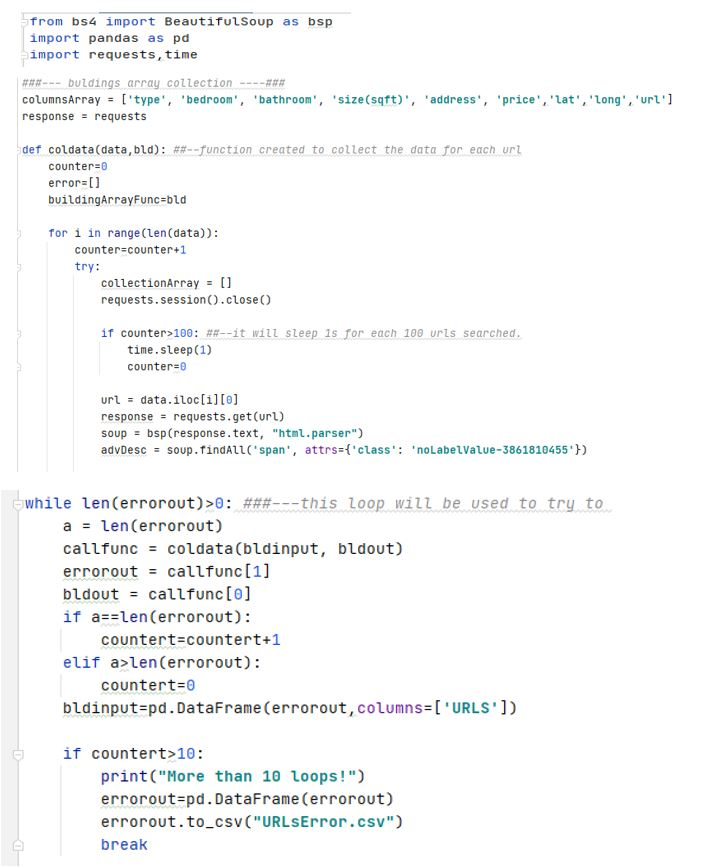

As newcomer in Montreal, one of the biggest problems I faced was the tough work to rent my first apartment. And it wasn’t only about the first one, I had the same problem with the second one. After some hard working through the internet, looking for information that could help me to find a place that I could afford and would be placed in a good neighborhood, I have found out three data sources that maybe would help me to rent my third home.
I have decided to create a way to merge all these data into a same place, because it could be better for visualizing. It was the reason why I chosen to create a dashboard in Power BI to consolidate the data and to add other relevance information. I have used the follows data sources to create my dashboard:
1.	https://www.kijiji.ca/ - I used to collect information about apartment price
2.	https://www.walkscore.com/ - to evaluate the facilities close to interest area
3.	https://donnees.montreal.ca/ville-de-montreal/actes-criminels - used to analyses area security
4.	https://www12.statcan.gc.ca/census-recensement/2016/dp-pd/prof/index.cfm?Lang=E – Montreal Census by Postal code. It describes little better the regions.
5.	https://www.compareschoolrankings.org/ - Secondary school rank for Montreal

The first step was to collect the data from the sources. In order to do that I have developed some applications in Python to run a web scrape over them. The mainly python libraries used in these applications were BeautifulSoup, Pandas, and Requests. The codes used are attached in this GitHub directory.  I have also used some VBA codes, that I have already had, to help to treat the harvested data. Let me do a short brief about the Python code to scrape the pages.
 Kijiji Web Scrape
Before developing the app, I have done some research into Kijiji page to identify the fields I wanted to collect. Based on this, I wrote some code lines and tried it. I realized that it would be necessary around 8000 searches on the page to get the data. One of the problems I would have, it would be the failure when a page wouldn’t be updated or returned a wrong page. To deal with this problem, I inserted a block with “try and except”, a loop with “While”, and a “time.sleep()” to deal with the exceptions. If the error persisted a file with the URLs not collected would be saved to be treated for me after.  Here there is some part of the code:
 
 

I did a similar work to collect data from the other pages.

Power BI
The next step after finishing the data picking was to load them to Power BI and draw the reports.  It took some time to be done. I have needed to restructure the data, creating relationship among the tables, and develop some measures. At the end of this tough job, I could rank each Montreal Postal code by the 6 factors below:

•	Price to rent

•	Infraction Number per day

•	Walk Score

•	Secondary Schools score

•	Language official (French or English) most used in that Postal Code

•	Immigrant population

After concluded the reports, I normalized the rank for the 101 Montreal Postal codes for each factor.  In order to highlight the factors more important, it was attributed a grade from 1 to 5 to be used to highlight the area in the MAP that fit better with my interest.  

Conclusion

I hope the time I spent doing this could help me on my next “chase” for an apartment.  Maybe, I try to add some more information, or I use some Machine Learning algorithm to evaluate better the decision results. I am not sure, but I will try to update the dashboard once a week, or develop some routine to automatize it. 

Power BI  Dashboard to help to make decisions, what place in Montreal to rent an apartment.
[Link to Dashboard](https://app.powerbi.com/Redirect?action=OpenApp&appId=0b8aabd5-a50f-44bb-89e8-abddf0132fc9&ctid=7cf0181d-8703-4824-ab4c-25bb0c35b56e)
